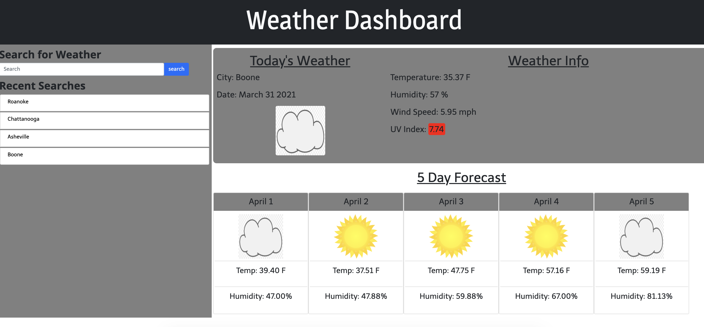

# 06 Server-Side APIs: Weather Dashboard

## Your Task

Third-party APIs allow developers to access their data and functionality by making requests with specific parameters to a URL. Developers are often tasked with retrieving data from another application's API and using it in the context of their own. My challenge is to build a weather dashboard that will run in the browser and feature dynamically updated HTML and CSS.

I used the [OpenWeather API](https://openweathermap.org/api) to retrieve weather data for cities. I used `localStorage` to store any persistent data.

## User Story

```
AS A traveler
I WANT to see the weather outlook for multiple cities
SO THAT I can plan a trip accordingly
```

## Acceptance Criteria

```
GIVEN a weather dashboard with form inputs
WHEN I search for a city
THEN I am presented with current and future conditions for that city and that city is added to the search history
WHEN I view current weather conditions for that city
THEN I am presented with the city name, the date, an icon representation of weather conditions, the temperature, the humidity, the wind speed, and the UV index
WHEN I view the UV index
THEN I am presented with a color that indicates whether the conditions are favorable, moderate, or severe
WHEN I view future weather conditions for that city
THEN I am presented with a 5-day forecast that displays the date, an icon representation of weather conditions, the temperature, and the humidity
WHEN I click on a city in the search history
THEN I am again presented with current and future conditions for that city
```


## Known Issues

- Site is not mobile responsive. I ran out of time to do this
- Error handling is not good. If a user adds an incorrect city, results are still added to page and errors result in console.
- UV Index is essentially a fake value. While investigating the docs, it seemed that the UV index was not easily available and that I'd have to make a separate API call to get it. So in lieu of that I just created a fake UV index function called createUVIndex(). This generates a random number between 0-10 and puts into the UV index location for today's weather. The UV index is then shaded accordingly. I know this is incorrect but I think I demonstrated that I'm able to make an API call and parse the response.


## Preview
The finished page looks like this:


